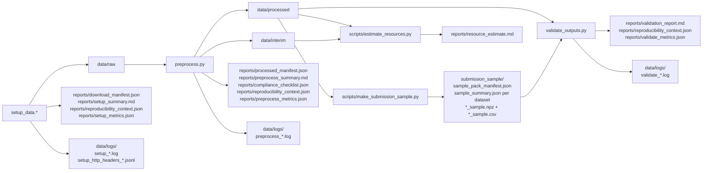

# Multimodal Preprocessing Pipeline

Reproducible download, harmonisation, preprocessing, validation, and reporting pipeline for:

- PAMAP2
- WISDM
- EEGMMIDB
- PTB-XL
- optional mHealth

The repository follows a clear separation of concerns:

- `setup_data.*`: folder creation, dataset acquisition, setup manifests, and setup logs
- `preprocess.py`: raw-to-interim-to-processed transformation
- `validate_outputs.py`: integrity checks and validation report generation

The shell and PowerShell wrappers provide lightweight command entrypoints only. Substantive setup, download orchestration, parsing, preprocessing, validation, and report generation are implemented in Python.

The pipeline also supports bundle-level resume for interrupted preprocessing runs via `python preprocess.py --resume`.

## Highlights

- Direct parallel HTTP download for EEGMMIDB EDF files
- Resumable and skip-aware downloads with `.part` files and remote-size checks
- Pooled HTTP sessions for repeated PTB-XL transfers when `requests` is available
- Reduced raw-storage redundancy via recursive archive cleanup after extraction
- Flexible HAR parsers for real raw-style layouts
- Explicit HAR label harmonisation with preserved original-label provenance
- Validation for array dtype, schema integrity, HAR harmonisation, EEG event metadata, ECG folds, and sample-pack consistency
- Automated unit and smoke tests

## Reviewer Guide

For a quick review, the most useful files to open first are:

- `README.md` for exact reproduction commands and output structure
- `preprocessing_plan.md` for the design summary
- `reports/project_features.md` for a feature-by-feature implementation map
- `reports/scientific_justification.md` for methodological rationale and caveats

## At A Glance

- **What this repo does**: downloads, harmonises, preprocesses, validates, and reports on multimodal time-series datasets for downstream SSL-ready use
- **Required datasets covered**: PAMAP2, WISDM, EEGMMIDB, PTB-XL
- **Bonus dataset covered**: mHealth
- **Key outputs**: fixed-shape float32 `npz` arrays, aligned metadata CSVs, manifests, validation report, and representative sample pack
- **Current automated verification**: `48` passing tests.
- **Jump to sections**: [Quick Start](#quick-start), [Pipeline Defaults](#pipeline-defaults), [Processing Strategy](#processing-strategy), [Sample Pack](#sample-pack), [Output Contract](#output-contract), [Reports and Artefacts](#reports-and-artefacts), [Testing and Verification](#testing-and-verification), [Scientific Caveats](#scientific-caveats)



## Repository Layout

```text
project_root/
|-- setup_data.sh
|-- setup_data.ps1
|-- setup_data.py
|-- preprocess.sh
|-- preprocess.ps1
|-- preprocess.py
|-- validate_outputs.sh
|-- validate_outputs.ps1
|-- validate_outputs.py
|-- configs/
|-- data/
|   |-- raw/
|   |-- interim/
|   |-- processed/
|   `-- logs/
|-- reports/
|-- scripts/
|-- submission_sample/
├── src/
│   └── mmprep/
│       ├── common/
│       ├── har/
│       ├── eeg/
│       └── ecg/
`-- tests/
```

## Reproducible Setup

Start by cloning the repository and opening a terminal in the project root. If the terminal opens elsewhere, change into the repository folder before creating the virtual environment or running any commands.

### Prerequisites

Before running the pipeline on a fresh machine, make sure the following are available:

- Python `3.10+`
- Network access for `pip` package installation and public-dataset downloads
- Enough disk space for raw downloads, interim outputs, processed outputs, and the representative sample pack
- On Linux/WSL, system support for `venv`; if missing, install `python3-venv`

Important scope note:

- Creating the virtual environment and running `pip install -e .[dev,physio]` handles the Python dependency layer
- It does not install Python itself, fix missing OS-level tooling, or bypass firewall/network restrictions
- Real EEG and ECG ingestion also require the optional scientific dependencies included in `.[physio]`

### macOS / Linux / WSL

Example:

```bash
git clone https://github.com/Alieyeh/Multimodal-Preprocessing-Pipeline/
cd multimodal-preprocessing-pipeline
```

On Ubuntu/WSL, if `venv` is missing, install it first:

```bash
sudo apt update
sudo apt install python3-venv
```

Then create the environment and install dependencies:

```bash
python3 -m venv .venv
source .venv/bin/activate
pip install --upgrade pip
pip install -e .[dev,physio]
```

### Windows PowerShell

Example:

```powershell
git clone <repository-url>
cd .\multimodal-preprocessing-pipeline
```

```powershell
python -m venv .venv
.\.venv\Scripts\Activate.ps1
pip install --upgrade pip
pip install -e .[dev,physio]
```

## Quick Start

For a standard end-to-end run from a fresh environment, the full Python only (without Wrapper Entrypoint) command sequence is:
```bash
python setup_data.py --config configs/default.yaml
python preprocess.py --config configs/default.yaml
python scripts/make_submission_sample.py --n 100 --clean
python validate_outputs.py --config configs/default.yaml
python scripts/estimate_resources.py
python -m pytest -q
```

## End-to-End Commands

### Wrapper Entrypoints

To prevent `Permission denied` when running the shell wrappers, mark them executable first (alternatively, you can use the `bash ` command instead of `./`):

```bash
chmod +x setup_data.sh preprocess.sh validate_outputs.sh
```

The setup and preprocess wrappers default to `configs/default.yaml`, so the no-argument path is the intended chosen path.

#### macOS / Linux

```bash
./setup_data.sh
./preprocess.sh
./validate_outputs.sh
```
The Unix wrappers prefer `.venv/bin/python` when present, otherwise they fall back to `python` and then `python3`.

#### Windows PowerShell

```powershell
.\setup_data.ps1
.\preprocess.ps1
.\validate_outputs.ps1
```

Example override:

```powershell
.\preprocess.ps1 --config configs/default.yaml --resume
```

### Create Representative Sample Pack and Estimate Resources

After generating the representative sample pack, rerun validation so the report includes sample-pack checks.

```bash
python scripts/make_submission_sample.py --n 100 --clean
python validate_outputs.py --config configs/default.yaml
python scripts/estimate_resources.py
```

### Run Unit and Smoke Tests
```bash
python -m pytest -q
```

If a long preprocess run is interrupted after some processed bundles already exist:

```bash
python preprocess.py --config configs/default.yaml --resume
```

## Execution Modes

The runtime config distinguishes between two failure-handling modes:

- `strict`: required dataset failures stop the stage with an error
- `best-effort`: missing or failed datasets are recorded and skipped so the rest of the pipeline can continue

Current defaults in [configs/default.yaml](configs/default.yaml):

- `runtime.setup_mode: strict`
- `runtime.preprocess_mode: best-effort`

This means setup is intentionally conservative about acquisition failures, while preprocessing is more tolerant once partial raw data already exist.

## Pipeline Defaults

### HAR

- Shared six-channel schema: `acc_x, acc_y, acc_z, gyro_x, gyro_y, gyro_z`
- Harmonised target sampling rate: 20 Hz
- Pretraining windows: 10 seconds, no overlap, unlabeled
- Supervised windows: 5 seconds, 50% overlap, majority non-null label
- Optional per-window standardisation: configurable and enabled by default
- Label provenance: `label_or_event` stores the harmonised label and `original_label` stores the source label

### EEG

- Required subset: runs 4, 8, and 12
- Windowing: 4 seconds from T1/T2 onset by default, with optional `T0` inclusion when explicitly enabled
- Default configured output rate: 160 Hz
- Light preprocessing: optional average reference, 1 to 40 Hz band-pass, optional notch, per-window normalisation
- `keep_native_rate` only preserves the native rate when it already matches the configured bundled rate; otherwise the signal is resampled so the final EEG bundle remains fixed-shape

### ECG

- Default PTB-XL rate: 100 Hz
- One processed sample per record
- Holdout test fold: configurable via `ecg.holdout_fold` (default `strat_fold == 10`)
- Remaining training records retain `cv_fold`
- Light preprocessing: per-lead mean removal plus per-record normalisation

## Processing Strategy

- Raw downloads are streamed to disk
- Archive-backed UCI datasets are extracted recursively and all extracted zip layers are removed afterward by default
- EEGMMIDB downloads only the requested subject/run EDF files
- PTB-XL downloads only the selected waveform tree
- HAR parsing and window generation start file-by-file, with final bundle assembly performed per output bundle
- EEG preprocessing is EDF-by-EDF and event-by-event
- ECG preprocessing is record-by-record
- Interim outputs are intentionally lean for EEG and ECG; HAR writes harmonised interim tables, which can still be large for WISDM-scale raw streams
- Root entrypoints write timestamped run logs under `data/logs/` while still printing progress to the terminal

## Logs and Metrics

Each root stage entrypoint writes a timestamped logfile to `data/logs/`:

- `setup_YYYYMMDD_HHMMSS.log`
- `preprocess_YYYYMMDD_HHMMSS.log`
- `validate_YYYYMMDD_HHMMSS.log`

The same entrypoints also write measured stage metrics to:

- `reports/setup_metrics.json`
- `reports/preprocess_metrics.json`
- `reports/validate_metrics.json`

When those files exist, `python scripts/estimate_resources.py` reports measured runtime and measured peak RAM instead of fallback heuristics. These metric files accumulate repeated attempts for the same stage, so interrupted runs can be reported as both latest-run time and cumulative time across resumes.

Measured peak RAM is reported when `psutil` is available in the active environment. In a standard fresh installation from this repository, that dependency is included.

Download progress note:

- Some HTTP servers do not return a reliable `Content-Length` or resumable byte-range total for every request. In those cases the progress bar may show `?` for the final size, may advance by downloaded bytes without a fixed endpoint, or may appear not to move much until more data arrive.
- This does not indicate a broken download. It reflects missing server-side size metadata, so the downloader can report bytes transferred but not an exact total in advance.
- The same source may behave slightly differently across runs if redirects, mirrors, cached headers, or resume responses expose different header information.
- Browser downloads can appear more reliable than CLI downloads on the same source because browsers typically retry more aggressively and handle redirects, mirrors, and partial responses more transparently. The setup script therefore validates downloaded archives before extraction and redownloads them cleanly if they are incomplete.
- This download-integrity behavior is independent of the `\strict` and `best-effort` modes. The runtime modes control whether the stage aborts or continues after a dataset failure, while archive validation and redownload are automatic pre-extraction safeguards that try to repair incomplete downloads before that failure-handling logic is needed.

## Sample Pack

The representative sample pack is generated with:

```bash
python scripts/make_submission_sample.py --n 100 --clean
```

The generator writes one representative pack per source dataset, with a target of 100 total rows per dataset. For HAR datasets, that budget is split across the pretrain and supervised bundles so both output types are represented while the dataset-level total remains 100.

```text
submission_sample/
|-- sample_pack_manifest.json
|-- har/
|   |-- pamap2/
|   |   |-- sample_summary.json
|   |   |-- pamap2_pretrain_sample.npz
|   |   |-- pamap2_pretrain_sample.csv
|   |   |-- pamap2_supervised_sample.npz
|   |   `-- pamap2_supervised_sample.csv
|   |-- wisdm/
|   |   |-- sample_summary.json
|   |   |-- wisdm_pretrain_sample.npz
|   |   |-- wisdm_pretrain_sample.csv
|   |   |-- wisdm_supervised_sample.npz
|   |   `-- wisdm_supervised_sample.csv
|   `-- mhealth/
|       |-- sample_summary.json
|       |-- mhealth_pretrain_sample.npz
|       |-- mhealth_pretrain_sample.csv
|       |-- mhealth_supervised_sample.npz
|       `-- mhealth_supervised_sample.csv
|-- eeg/
|   `-- eegmmidb/
|       |-- sample_summary.json
|       |-- eegmmidb_events_sample.npz
|       `-- eegmmidb_events_sample.csv
`-- ecg/
    `-- ptbxl/
        |-- sample_summary.json
        |-- ptbxl_records_sample.npz
        `-- ptbxl_records_sample.csv
```

Each sample `.csv` preserves the same metadata contract as the full processed outputs. The generator also writes `submission_sample/sample_pack_manifest.json`, which records the expected per-file counts and shapes, plus one `sample_summary.json` per dataset folder so a reviewer can immediately see how that dataset's representative sample is composed. Validation uses the manifest to check exact sample counts, exact expected shapes, and the 100-total-rows-per-dataset contract.

Use `--clean` when regenerating the sample pack so legacy files from earlier runs are removed first.

## Output Contract

Processed arrays are written as float32 `npz` files with key `X`.

Metadata CSV rows include at least:

- `sample_id`
- `dataset_name`
- `modality`
- `subject_or_patient_id`
- `source_file_or_record`
- `split`
- `label_or_event`
- `sampling_rate_hz`
- `n_channels`
- `n_samples`
- `channel_schema`
- `qc_flags`

Additional modality-specific fields include:

- HAR: `window_kind`, `null_label_policy`, `original_label`, `label_schema_name`
- EEG: `run_id`, `event_code`, `event_onset`, `event_onset_seconds`
- ECG: `strat_fold`, `cv_fold`, `patient_safe_split`, `lead_names`

`validate_outputs.py` also prints a short terminal summary showing the report path, processed-bundle count, sample-pack count, and final PASS/FAIL state. When `--config` is supplied, validation enforces configured EEG runs and event codes, plus config-driven ECG output checks such as sampling rate, lead order, and holdout-fold reporting.

Some metadata fields are intentionally blank for specific output types: HAR pretraining outputs leave `\label_or_event` and `original_label` empty because those windows are unlabeled; EEG outputs keep `split` as `unspecified` because the pipeline preserves event-level provenance without imposing train/validation/test partitions; and ECG outputs leave `cv_fold` empty for held-out test rows because cross-validation metadata apply only to the training partition.

## Reports and Artefacts

| Artefact | What it contains |
|---|---|
| `preprocessing_plan.md` | Concise design summary covering schema choices, windowing, label handling, provenance, and resource notes |
| `submission_sample/sample_pack_manifest.json` | Machine-readable description of the representative sample pack, including expected rows and shapes per sample file |
| `submission_sample/<modality>/<dataset>/sample_summary.json` | Dataset-level explanation of how each representative sample is composed, including the split across HAR pretrain/supervised sample files |
| `reports/scientific_justification.md` | Methodological rationale for preprocessing defaults, harmonisation choices, and scientific caveats |
| `reports/project_features.md` | Feature-by-feature mapping from project goals to repository files and outputs |
| `reports/clinical_dataset_adaptation.md` | Optional note on how the same pipeline design could be adapted to Parkinson's and biobank-style datasets |
| `reports/download_manifest.json` | Machine-readable setup manifest with dataset source URLs, timestamps, versions, statuses, and download details |
| `reports/setup_summary.md` | Human-readable summary of setup outcomes across datasets |
| `reports/reproducibility_context.json` | Lightweight reproducibility provenance recording the active config fingerprint, Python/platform context, and completed stages |
| `reports/setup_metrics.json` | Measured setup-stage runtime and peak RAM from the latest run, plus cumulative attempt metadata |
| `reports/preprocess_summary.md` | Human-readable summary of preprocessing mode, manifest size, and resource-aware execution choices |
| `reports/processed_manifest.json` | Machine-readable index of generated processed files, including shapes, sizes, and row counts |
| `reports/preprocess_metrics.json` | Measured preprocess-stage runtime and peak RAM from the latest run, plus cumulative attempt metadata |
| `reports/compliance_checklist.json` | Machine-readable checklist of setup/preprocess artefacts and output coverage |
| `reports/validation_report.md` | Validation results for array integrity, schema checks, harmonisation checks, fold checks, and sample-pack verification |
| `reports/validate_metrics.json` | Measured validation-stage runtime and peak RAM from the latest run, plus cumulative attempt metadata |
| `reports/resource_estimate.md` | Storage footprint summary plus measured or estimated RAM/runtime expectations |


For provenance clarity, the setup stage records an explicit source label in the download manifest whenever one can be determined. PhysioNet datasets retain their semantic source versions (`1.0.0`, `1.0.3`), while the UCI datasets fall back to stable repository identifiers (`uci-public-231`, `uci-public-507`, `uci-public-319`) when no semantic version is exposed in the source URL.

## Testing and Verification

Current automated coverage includes:

- setup-stage directory and manifest smoke tests
- preprocessing smoke tests through the root entrypoints
- HAR parser tolerance checks for candidate raw column names
- HAR windowing checks
- submission sample size checks
- regression coverage for unified HAR labels and interim/report outputs

The current version of the project passes `48` automated tests locally.

For a measured coverage report rather than just test counts:

```bash
python -m pytest --cov=src/mmprep --cov-report=term-missing
```
Validation can run before the representative sample pack is generated, but the report states clearly when `submission_sample/` has not yet been populated. Once sample files exist, validation checks them against `submission_sample/sample_pack_manifest.json`.

This repository reports the number and types of tests by default; it does not claim a numeric coverage percentage unless that command has been run in the current environment.

## Scientific Caveats

- PTB-XL labels are currently reduced to one primary SCP code per record for a simple record-level output contract; this is practical for a lightweight baseline but less expressive than the dataset's native multi-label structure.
- HAR unmatched activities are routed to `other`, which is operationally convenient but scientifically heterogeneous.
- EEG per-window z-scoring is a light, defensible default for modelling, but it intentionally deemphasizes absolute amplitude differences.
- The default 60 Hz notch matches EEGMMIDB's typical mains environment; for 50 Hz environments the config should be changed accordingly.

## Clinical Transferability

The pipeline's design principles map directly to Parkinson's and biobank-style datasets. For ML purposes, this is best understood as a strong training-ready baseline for SSL and early supervised modelling, because it preserves signal-level structure, provenance, and inspectable fixed-shape outputs without overcommitting to one downstream task.

| Design principle | Relevance to Parkinson's research datasets |
|---|---|
| Subject-level provenance | prevents leakage in longitudinal studies such as PPMI and similar repeated-visit cohorts |
| Resumable downloads | practical for large controlled-access or multi-GB transfers |
| Metadata preservation | supports carrying visit, medication, and assessment context into downstream analyses |
| Modular parsers | makes it straightforward to add new wearable, EHR, or cohort-specific sources |

Example adaptations:

If this repository were used in a later disease-modelling phase rather than as a preprocessing baseline, the main areas to revisit would be task-specific label strategy, cohort-specific artifact handling, and whether broader harmonization buckets such as HAR `other` are still scientifically appropriate for the target endpoint.

- **PPMI wearables**: extend `src/mmprep/har/` with a parser for PPMI wrist accelerometry or related wearable exports
- **UK Biobank accelerometry**: reuse the same chunked-processing and provenance-preserving design for large-scale wrist activity files
- **EHR-linked cohorts**: add new parser modules while keeping the same manifest, validation, and leakage-aware metadata pattern

## Practical Notes

- Setup is intentionally strict about required download failures, while preprocessing can run in `best-effort` mode when partial raw data already exist
- Validation can run before the representative sample pack is generated, but the report states clearly when `submission_sample/` has not yet been populated; once sample files exist, validation checks them against `submission_sample/sample_pack_manifest.json`
- If archive retention is needed for audit purposes, set `runtime.remove_archives_after_extract: false` in [configs/default.yaml](configs/default.yaml)
